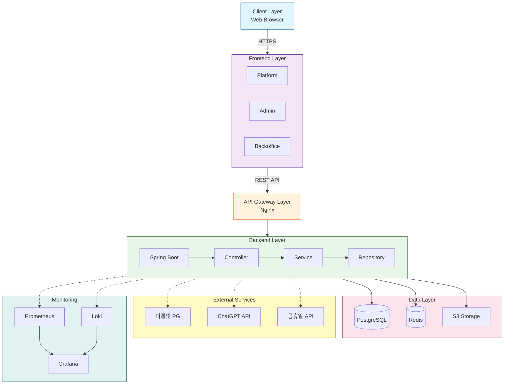
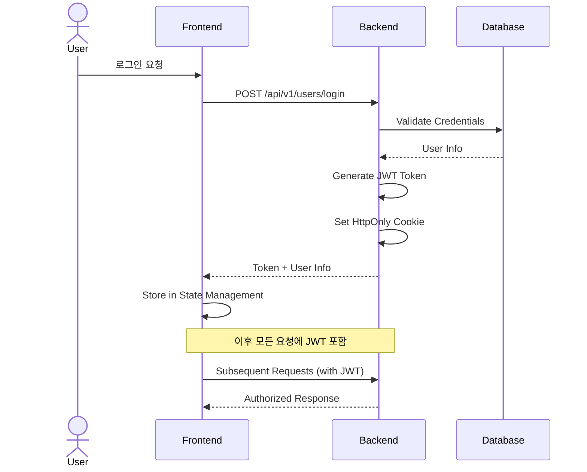
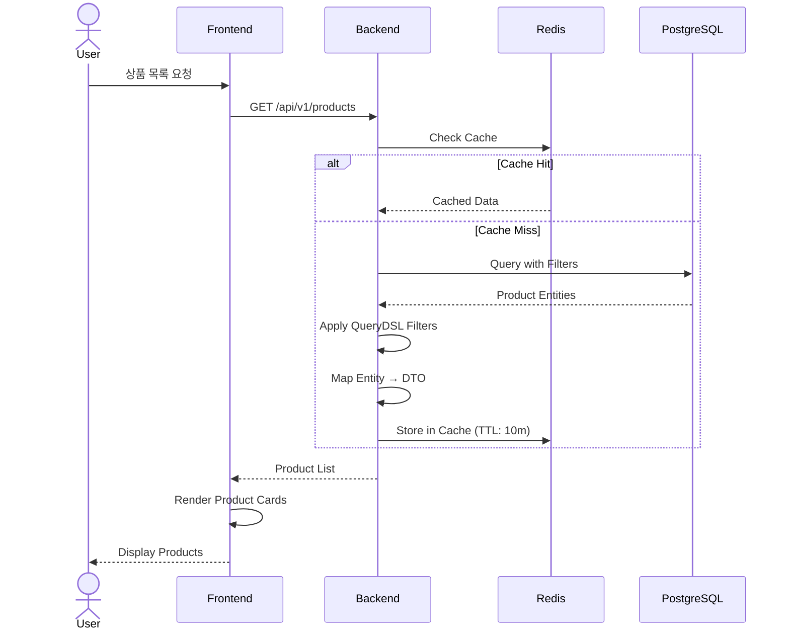
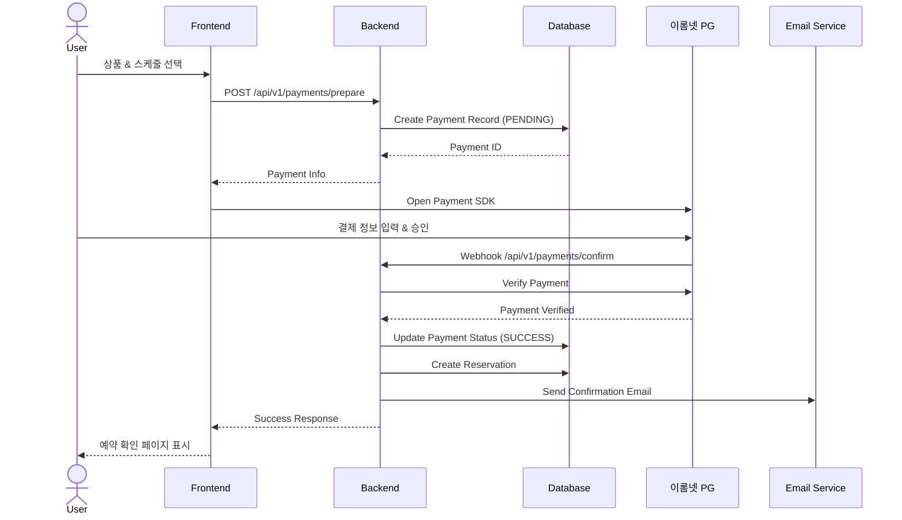
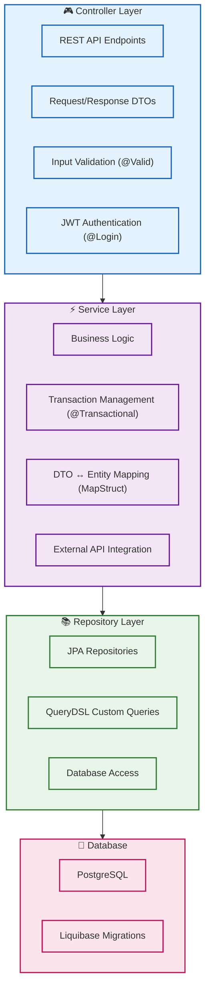
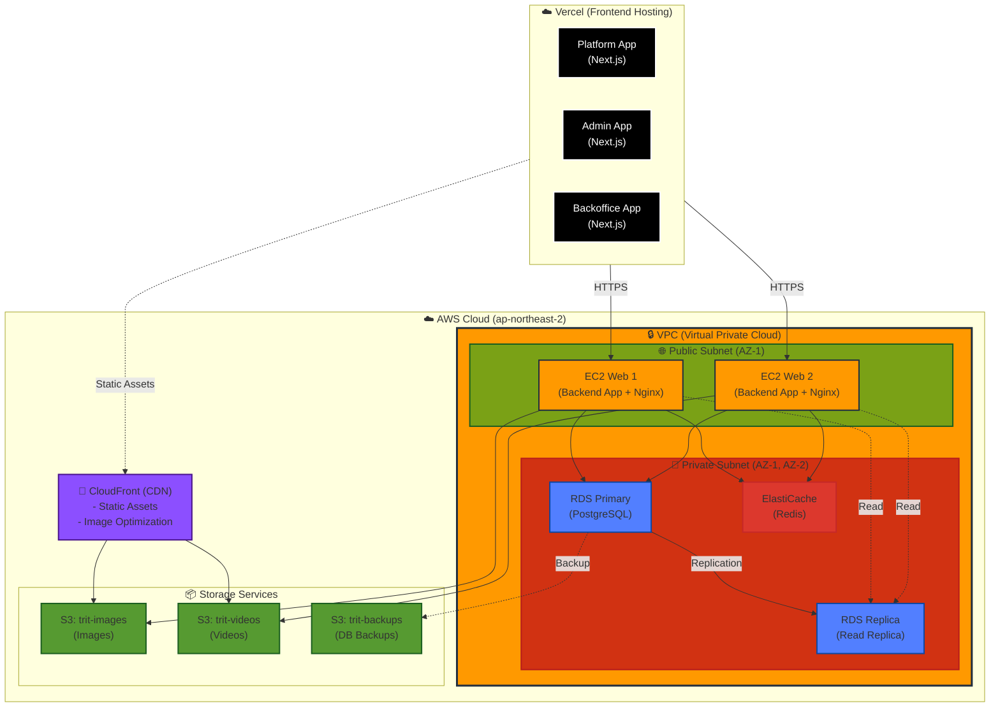
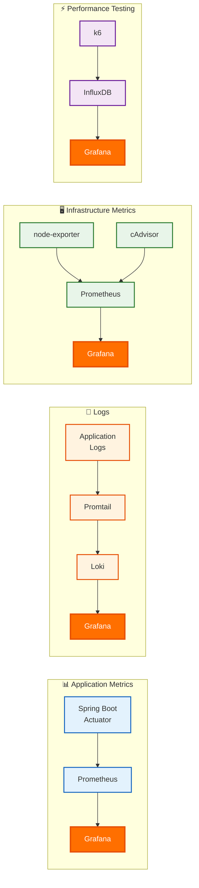

# TRIT 시스템 아키텍처

> TRIT 프로젝트의 전체 시스템 아키텍처, 기술 결정 사항, 설계 원칙을 설명합니다.

**문서 버전**: 1.0.0  
**최종 업데이트**: 2025-10-15

---

## 📋 목차

- [시스템 개요](#-시스템-개요)
- [아키텍처 다이어그램](#-아키텍처-다이어그램)
- [Frontend 아키텍처](#-frontend-아키텍처)
- [Backend 아키텍처](#%EF%B8%8F-backend-아키텍처)
- [데이터베이스 설계](#-데이터베이스-설계)
- [인프라 아키텍처](#-인프라-아키텍처)
- [보안 아키텍처](#-보안-아키텍처)
- [성능 최적화](#-성능-최적화)
- [모니터링 및 관찰성](#-모니터링-및-관찰성)
- [기술 의사결정 기록 (ADR)](#-기술-의사결정-기록-adr)

---

## 🎯 시스템 개요

### 비즈니스 목표

TRIT은 여행자, 크리에이터, 여행 업체를 연결하는 통합 플랫폼으로, 다음 목표를 달성합니다:

1. **사용자 경험**: 직관적이고 빠른 여행 콘텐츠 탐색 및 예약
2. **확장성**: 트래픽 증가에 대응 가능한 유연한 아키텍처
3. **안정성**: 99.9% 이상의 서비스 가용성
4. **보안**: 개인정보 및 결제 정보의 안전한 처리
5. **유지보수성**: 빠른 기능 개발 및 버그 수정 가능

### 핵심 설계 원칙

#### 1. 관심사의 분리 (Separation of Concerns)

- Frontend와 Backend의 명확한 역할 분리
- 도메인별 모듈화 (DDD 일부 적용)
- 레이어드 아키텍처 (Controller → Service → Repository)

#### 2. 확장 가능성 (Scalability)

- 마이크로서비스 전환 가능한 모듈 구조
- 수평 확장 가능한 컨테이너 기반 배포
- 캐싱 전략을 통한 데이터베이스 부하 분산

#### 3. 유지보수성 (Maintainability)

- 명확한 코딩 컨벤션 및 문서화
- 자동화된 테스트 및 CI/CD 파이프라인
- 타입 안정성 (TypeScript, Java)

#### 4. 보안 우선 (Security First)

- JWT 기반 인증/인가
- HTTPS 통신 강제
- 민감 정보 암호화 저장
- OWASP Top 10 보안 취약점 대응

---

## 🏗 아키텍처 다이어그램

### 전체 시스템 아키텍처



### 주요 통신 플로우

#### 1. 사용자 인증 플로우



#### 2. 상품 조회 플로우



#### 3. 예약 및 결제 플로우



---

## 🎨 Frontend 아키텍처

### 모노레포 구조 (Turborepo)

```plaintext
TRIT-FE/
├── apps/
│   ├── platform/          # 사용자용 웹 애플리케이션
│   │   ├── src/
│   │   │   ├── app/       # Next.js App Router Pages
│   │   │   ├── components/# Page-specific Components
│   │   │   ├── lib/       # API Clients, Utils
│   │   │   └── styles/    # Global Styles
│   │   └── package.json
│   │
│   ├── admin/             # 관리자 대시보드
│   │   └── src/...
│   │
│   └── backoffice/        # 내부 운영 도구
│       └── src/...
│
├── packages/
│   ├── ui/                # Shared Component Library
│   │   ├── src/
│   │   │   ├── Button/
│   │   │   ├── Input/
│   │   │   ├── Modal/
│   │   │   └── ...
│   │   ├── .storybook/    # Storybook Config
│   │   └── vitest.config.ts
│   │
│   ├── types/             # Shared TypeScript Types
│   │   └── src/
│   │       ├── api.ts     # API Request/Response Types
│   │       ├── domain.ts  # Domain Models
│   │       └── index.ts
│   │
│   ├── hooks/             # Shared React Hooks
│   │   └── src/
│   │       ├── useAuth.ts
│   │       ├── useDebounce.ts
│   │       └── ...
│   │
│   ├── utils/             # Shared Utilities
│   │   └── src/
│   │       ├── format.ts
│   │       ├── validate.ts
│   │       └── constants.ts
│   │
│   ├── next-config/       # Shared Next.js Config
│   └── tailwind-config/   # Shared Tailwind Config
│
└── turbo.json             # Turborepo Pipeline Config
```

### 주요 아키텍처 패턴

#### 1. Feature-First Structure

각 페이지/기능별로 컴포넌트를 그룹화하여 응집도를 높입니다.

```typescript
src/app/products/
├── [id]/
│   ├── page.tsx              # Product Detail Page
│   ├── ProductDetail.tsx     # Main Component
│   ├── ProductImages.tsx     # Sub Component
│   ├── ProductInfo.tsx       # Sub Component
│   └── useProductDetail.ts   # Custom Hook
├── page.tsx                  # Product List Page
└── ProductList.tsx
```

#### 2. API Client Layer

중앙화된 API 클라이언트로 일관된 에러 처리 및 인증 관리

```typescript
// lib/api/client.ts
export class ApiClient {
  private baseUrl: string;
  private defaultHeaders: HeadersInit;

  async request<T>(endpoint: string, options?: RequestInit): Promise<T> {
    // Automatic JWT attachment
    // Error handling
    // Response parsing
  }
}

// lib/api/products.ts
export const productApi = {
  getAll: (params: ProductListParams) => 
    client.request<PageResponse<Product>>('/api/v1/products', { params }),
  
  getById: (id: number) => 
    client.request<ProductDetail>(`/api/v1/products/${id}`),
  
  // ...
};
```

#### 3. State Management Strategy

**React Query** for Server State:

```typescript
// hooks/useProducts.ts
export function useProducts(params: ProductListParams) {
  return useQuery({
    queryKey: ['products', params],
    queryFn: () => productApi.getAll(params),
    staleTime: 5 * 60 * 1000, // 5 minutes
    cacheTime: 10 * 60 * 1000, // 10 minutes
  });
}
```

**Zustand** for Client State:

```typescript
// stores/authStore.ts
export const useAuthStore = create<AuthState>((set) => ({
  user: null,
  isAuthenticated: false,
  login: (user) => set({ user, isAuthenticated: true }),
  logout: () => set({ user: null, isAuthenticated: false }),
}));
```

#### 4. Design System (@repo/ui)

일관된 UI/UX를 위한 컴포넌트 라이브러리:

```typescript
// packages/ui/src/Button/Button.tsx
export interface ButtonProps {
  variant: 'primary' | 'secondary' | 'ghost';
  size: 'sm' | 'md' | 'lg';
  children: React.ReactNode;
  onClick?: () => void;
  disabled?: boolean;
}

export const Button: React.FC<ButtonProps> = ({
  variant = 'primary',
  size = 'md',
  ...props
}) => {
  // Implementation with Tailwind classes
};
```

Storybook으로 문서화:

```typescript
// packages/ui/src/Button/Button.stories.tsx
export default {
  title: 'Components/Button',
  component: Button,
} as Meta;

export const Primary: Story = {
  args: {
    variant: 'primary',
    children: 'Click me',
  },
};
```

---

## ⚙️ Backend 아키텍처

### 레이어드 아키텍처



### 도메인 모듈 구조

각 도메인은 독립적인 패키지로 관리되며, 향후 마이크로서비스 전환 가능:

```plaintext
backend/src/main/java/today/story/backend/product/
├── controller/
│   └── ProductController.java
├── service/
│   ├── ProductService.java
│   ├── ProductSearchService.java
│   └── ProductScheduleService.java
├── repository/
│   ├── ProductRepository.java
│   └── ProductRepositoryCustom.java
├── domain/
│   ├── Product.java                    # Entity
│   ├── ProductSchedule.java            # Entity
│   └── ProductStatus.java              # Enum
└── dto/
    ├── request/
    │   ├── ProductCreateRequest.java
    │   └── ProductUpdateRequest.java
    └── response/
        ├── ProductResponse.java
        └── DetailProductResponse.java
```

### 주요 컴포넌트

#### 1. 인증/인가 (Authentication & Authorization)

```java
// JWT Filter
@Component
public class JwtAuthenticationFilter extends OncePerRequestFilter {
  
  @Override
  protected void doFilterInternal(HttpServletRequest request, 
                                   HttpServletResponse response, 
                                   FilterChain filterChain) {
    // Extract JWT from Cookie or Header
    // Validate Token
    // Set Authentication in SecurityContext
  }
}

// Custom Annotation for User Info Injection
@Target(ElementType.PARAMETER)
@Retention(RetentionPolicy.RUNTIME)
public @interface Login {
}

// Controller Usage
@GetMapping("/me")
public ResultResponse<UserResponse> getMyInfo(@Login AuthInfo authInfo) {
  return userService.getMyInfo(authInfo);
}
```

#### 2. 공통 응답 포맷

모든 API는 일관된 응답 구조 사용:

```java
// Success Response
@Getter
@AllArgsConstructor
public class ResultResponse<T> {
  private boolean success;
  private T data;
  private String message;
  private String errorCode;
  
  public static <T> ResultResponse<T> success(T data) {
    return new ResultResponse<>(true, data, null, null);
  }
  
  public static <T> ResultResponse<T> error(ErrorCode errorCode, String message) {
    return new ResultResponse<>(false, null, message, errorCode.getCode());
  }
}

// Paginated Response
@Getter
@AllArgsConstructor
public class PageResponse<T> {
  private List<T> content;
  private int page;
  private int size;
  private long totalElements;
  private int totalPages;
  private boolean first;
  private boolean last;
}
```

#### 3. 예외 처리

```java
@RestControllerAdvice
public class GlobalExceptionHandler {
  
  @ExceptionHandler(EntityNotFoundException.class)
  public ResponseEntity<ResultResponse<Void>> handleNotFound(EntityNotFoundException e) {
    return ResponseEntity.status(HttpStatus.NOT_FOUND)
        .body(ResultResponse.error(ErrorCode.NOT_FOUND, e.getMessage()));
  }
  
  @ExceptionHandler(ValidationException.class)
  public ResponseEntity<ResultResponse<Void>> handleValidation(ValidationException e) {
    return ResponseEntity.status(HttpStatus.BAD_REQUEST)
        .body(ResultResponse.error(ErrorCode.INVALID_INPUT, e.getMessage()));
  }
  
  // ... more handlers
}
```

#### 4. QueryDSL을 활용한 동적 쿼리

```java
@Repository
@RequiredArgsConstructor
public class ProductRepositoryCustomImpl implements ProductRepositoryCustom {
  
  private final JPAQueryFactory queryFactory;
  
  @Override
  public Page<Product> findByFilters(ProductSearchCondition condition, Pageable pageable) {
    BooleanBuilder builder = new BooleanBuilder();
    
    if (condition.getCategory() != null) {
      builder.and(product.category.eq(condition.getCategory()));
    }
    
    if (condition.getMinPrice() != null) {
      builder.and(product.price.goe(condition.getMinPrice()));
    }
    
    if (condition.getMaxPrice() != null) {
      builder.and(product.price.loe(condition.getMaxPrice()));
    }
    
    List<Product> products = queryFactory
        .selectFrom(product)
        .where(builder)
        .offset(pageable.getOffset())
        .limit(pageable.getPageSize())
        .fetch();
    
    long total = queryFactory
        .selectFrom(product)
        .where(builder)
        .fetchCount();
    
    return new PageImpl<>(products, pageable, total);
  }
}
```

#### 5. N+1 문제 해결 전략

**Two-Step Pagination + Fetch Join**:

```java
@Service
@RequiredArgsConstructor
public class ProductService {
  
  public Page<ProductResponse> getProducts(Pageable pageable) {
    // Step 1: Get IDs only with pagination
    Page<Long> productIds = productRepository.findAllIds(pageable);
    
    // Step 2: Fetch with associations
    List<Product> products = productRepository.findByIdInWithFetchJoin(
        productIds.getContent()
    );
    
    // Map to DTOs
    List<ProductResponse> responses = products.stream()
        .map(productMapper::toResponse)
        .collect(Collectors.toList());
    
    return new PageImpl<>(responses, pageable, productIds.getTotalElements());
  }
}
```

---

## 🗄 데이터베이스 설계

### ERD 주요 엔티티

```plaintext
Users (사용자)
├── id (PK)
├── loginId
├── email
├── nickname
├── role (USER, CREATOR, COMPANY, ADMIN)
└── createdAt

Creators (크리에이터)
├── id (PK)
├── userId (FK → Users)
├── creatorName
└── introduction

Companies (업체)
├── id (PK)
├── userId (FK → Users)
├── companyName
├── businessNumber
└── address

Products (상품)
├── id (PK)
├── companyId (FK → Companies)
├── name
├── description
├── price
├── category
├── status (ACTIVE, INACTIVE, SOLD_OUT)
└── createdAt

ProductSchedules (상품 스케줄)
├── id (PK)
├── productId (FK → Products)
├── date
├── startTime
├── endTime
├── capacity
└── remainingCapacity

Reservations (예약)
├── id (PK)
├── userId (FK → Users)
├── productId (FK → Products)
├── scheduleId (FK → ProductSchedules)
├── status (PENDING, CONFIRMED, CANCELLED, COMPLETED)
├── reservationDate
├── totalPrice
└── createdAt

Payments (결제)
├── id (PK)
├── reservationId (FK → Reservations)
├── userId (FK → Users)
├── amount
├── status (PENDING, SUCCESS, FAILED, CANCELLED)
├── paymentMethod
├── pgTransactionId
└── createdAt

Contents (콘텐츠)
├── id (PK)
├── creatorId (FK → Creators)
├── title
├── content
├── category
├── viewCount
├── likeCount
└── createdAt

Reviews (리뷰)
├── id (PK)
├── reservationId (FK → Reservations)
├── userId (FK → Users)
├── productId (FK → Products)
├── rating
├── content
└── createdAt

Playlists (플레이리스트)
├── id (PK)
├── userId (FK → Users)
├── name
├── description
└── isPublic

PlaylistContents (플레이리스트-콘텐츠 매핑)
├── id (PK)
├── playlistId (FK → Playlists)
├── contentId (FK → Contents)
└── order

Coupons (쿠폰)
├── id (PK)
├── code
├── discountType (PERCENT, FIXED)
├── discountValue
├── minPurchaseAmount
├── validFrom
├── validUntil
└── usageLimit

UserCoupons (사용자 쿠폰)
├── id (PK)
├── userId (FK → Users)
├── couponId (FK → Coupons)
├── usedAt
└── isUsed
```

### 인덱스 전략

#### 조회 성능 최적화

```sql
-- 상품 검색 최적화
CREATE INDEX idx_product_category ON products(category);
CREATE INDEX idx_product_status ON products(status);
CREATE INDEX idx_product_price ON products(price);
CREATE INDEX idx_product_created_at ON products(created_at DESC);

-- 예약 조회 최적화
CREATE INDEX idx_reservation_user ON reservations(user_id, created_at DESC);
CREATE INDEX idx_reservation_product ON reservations(product_id, reservation_date);
CREATE INDEX idx_reservation_status ON reservations(status);

-- 콘텐츠 검색 최적화
CREATE INDEX idx_contents_category ON contents(category);
CREATE INDEX idx_contents_creator ON contents(creator_id, created_at DESC);
CREATE INDEX idx_contents_view_count ON contents(view_count DESC);
```

### Liquibase 마이그레이션 전략

```yaml
# db/changelog/2025/2025-10-15-add-product-indexes.yaml
databaseChangeLog:
  - changeSet:
      id: 2025-10-15-add-product-indexes
      author: backend-team
      changes:
        - createIndex:
            indexName: idx_product_category
            tableName: products
            columns:
              - column:
                  name: category
        - createIndex:
            indexName: idx_product_status
            tableName: products
            columns:
              - column:
                  name: status
      rollback:
        - dropIndex:
            indexName: idx_product_category
            tableName: products
        - dropIndex:
            indexName: idx_product_status
            tableName: products
```

---

## 🚀 인프라 아키텍처

### AWS 인프라



### 배포 아키텍처

#### Zero-Downtime Deployment

```bash
# deploy-script.sh 주요 로직

# 1. 새 이미지 빌드
docker build -t trit-backend:new .

# 2. 기존 컨테이너 중 하나 교체
docker stop backend-app-1
docker rm backend-app-1
docker run -d --name backend-app-1 trit-backend:new

# 3. Health Check 대기
while ! curl -f http://localhost:8080/actuator/health; do
  sleep 5
done

# 4. Nginx upstream 갱신 (자동)
# Nginx가 Health Check를 통해 트래픽 자동 라우팅

# 5. 나머지 컨테이너 교체
docker stop backend-app-2
docker rm backend-app-2
docker run -d --name backend-app-2 trit-backend:new

# 6. 이전 이미지 정리
docker rmi trit-backend:old
```

### Docker Compose 구성

```yaml
# docker-compose.deploy.yml (Production)
version: '3.8'

services:
  backend-app-1:
    image: trit-backend:latest
    container_name: backend-app-1
    environment:
      SPRING_PROFILES_ACTIVE: prod
      SPRING_DATASOURCE_URL: jdbc:postgresql://rds-endpoint/trit
    ports:
      - "8081:8080"
    networks:
      - trit-network
    restart: unless-stopped

  backend-app-2:
    image: trit-backend:latest
    container_name: backend-app-2
    environment:
      SPRING_PROFILES_ACTIVE: prod
      SPRING_DATASOURCE_URL: jdbc:postgresql://rds-endpoint/trit
    ports:
      - "8082:8080"
    networks:
      - trit-network
    restart: unless-stopped

  nginx:
    image: nginx:alpine
    container_name: nginx-lb
    volumes:
      - ./nginx/nginx.conf:/etc/nginx/nginx.conf:ro
    ports:
      - "80:80"
      - "443:443"
    depends_on:
      - backend-app-1
      - backend-app-2
    networks:
      - trit-network
    restart: unless-stopped

networks:
  trit-network:
    driver: bridge
```

---

## 🔒 보안 아키텍처

### 인증 및 인가

#### JWT 기반 인증

```java
// JWT Token Structure
{
  "header": {
    "alg": "HS256",
    "typ": "JWT"
  },
  "payload": {
    "sub": "user-id",
    "role": "USER",
    "exp": 1640995200,
    "iat": 1640908800
  },
  "signature": "..."
}
```

**토큰 저장 전략**:

- **Access Token**: HttpOnly Cookie (XSS 방지)
- **Refresh Token**: Secure HttpOnly Cookie, Database 저장
- **만료 시간**: Access Token 1시간, Refresh Token 14일

#### 권한 관리

```java
// Controller Layer
@GetMapping("/admin/users")
public ResponseEntity<ResultResponse<PageResponse<UserResponse>>> getAllUsers(
  @Login AuthInfo authInfo
) {
  // Admin only
}

// Service Layer
@Override
public ResultResponse<PageResponse<UserResponse>> getAllUesrs(
  AuthInfo authInfo
){
  if(!authInfo.isAdmin()){
    throw new NoGrantedException();
  }
}
```

### API 보안

#### CORS 설정

```java
@Configuration
public class WebConfig implements WebMvcConfigurer {
  
  @Override
  public void addCorsMappings(CorsRegistry registry) {
    registry.addMapping("/api/**")
        .allowedOrigins("https://trit.app", "https://admin.trit.app","https://backoffice.trit.app")
        .allowedMethods("GET", "POST", "PUT", "DELETE", "PATCH")
        .allowedHeaders("*")
        .allowCredentials(true)
        .maxAge(3600);
  }
}
```

---

## ⚡ 성능 최적화

### 데이터베이스 최적화

#### Connection Pool 설정

```yaml
spring:
  datasource:
    hikari:
      minimum-idle: 10
      maximum-pool-size: 50
      idle-timeout: 300000
      max-lifetime: 1800000
      connection-timeout: 20000
```

#### Query 최적화 체크리스트

- ✅ N+1 문제 해결 (Fetch Join, Two-Step Pagination)
- ✅ 적절한 인덱스 설계
- ✅ Covering Index 활용
- ✅ 페이지네이션 최적화 (Offset 대신 Keyset 고려)
- ✅ Batch Insert/Update 사용
- ✅ 불필요한 컬럼 조회 방지 (DTO Projection)

### Frontend 성능 최적화

#### Next.js 최적화

```typescript
// 1. Static Generation for Public Pages
export const generateStaticParams = async () => {
  const products = await getPopularProducts();
  return products.map((product) => ({
    id: product.id.toString(),
  }));
};

// 2. Dynamic Imports for Code Splitting
const HeavyComponent = dynamic(() => import('./HeavyComponent'), {
  loading: () => <Spinner />,
  ssr: false, // Client-side only if needed
});

// 3. Image Optimization
import Image from 'next/image';

<Image
  src="/product-image.jpg"
  alt="Product"
  width={800}
  height={600}
  priority={true} // LCP optimization
  placeholder="blur"
/>

// 4. Font Optimization
import { Inter } from 'next/font/google';

const inter = Inter({
  subsets: ['latin'],
  display: 'swap',
});
```

#### React 최적화

```typescript
// Memoization
const MemoizedProductCard = React.memo(ProductCard, (prev, next) => {
  return prev.product.id === next.product.id &&
         prev.product.likeCount === next.product.likeCount;
});

// Virtualized Lists
import { FixedSizeList } from 'react-window';

<FixedSizeList
  height={800}
  itemCount={products.length}
  itemSize={200}
  width="100%"
>
  {({ index, style }) => (
    <div style={style}>
      <ProductCard product={products[index]} />
    </div>
  )}
</FixedSizeList>
```

---

## 📊 모니터링 및 관찰성

### 모니터링 스택



### 주요 메트릭

#### Application Metrics

```java
// Custom Metrics with Micrometer
@Service
public class ProductService {
  
  private final MeterRegistry meterRegistry;
  private final Counter productViewCounter;
  private final Timer productQueryTimer;
  
  public ProductService(MeterRegistry meterRegistry) {
    this.meterRegistry = meterRegistry;
    this.productViewCounter = Counter.builder("product.views")
        .tag("service", "product")
        .register(meterRegistry);
    this.productQueryTimer = Timer.builder("product.query.time")
        .register(meterRegistry);
  }
  
  public ProductResponse getProduct(Long id) {
    return productQueryTimer.record(() -> {
      productViewCounter.increment();
      // Query logic...
    });
  }
}
```

#### Grafana 대시보드

**시스템 대시보드**:

- CPU/Memory/Disk 사용률
- Network I/O
- Container Health Status

**애플리케이션 대시보드**:

- API Request Rate (req/s)
- Response Time (p50, p95, p99)
- Error Rate
- Active DB Connections
- Cache Hit Rate

**비즈니스 대시보드**:

- Daily Active Users (DAU)
- Reservation Conversion Rate
- Payment Success Rate
- Content Upload Rate

### 로깅 전략

```java
// Structured Logging with Log4j2
@Slf4j
@Service
public class PaymentService {
  
  public void processPayment(PaymentRequest request) {
    log.info("Payment processing started - orderId: {}, userId: {}, amount: {}",
        request.getOrderId(),
        request.getUserId(),
        request.getAmount());
    
    try {
      // Process payment...
      
      log.info("Payment successful - orderId: {}, transactionId: {}",
          request.getOrderId(),
          response.getTransactionId());
          
    } catch (PaymentException e) {
      log.error("Payment failed - orderId: {}, error: {}",
          request.getOrderId(),
          e.getMessage(),
          e); // Stack trace
    }
  }
}
```

**로그 레벨 전략**:

- **ERROR**: 즉시 대응 필요한 오류
- **WARN**: 주의 필요한 상황 (deprecated API 사용, 성능 저하 등)
- **INFO**: 주요 비즈니스 이벤트 (로그인, 결제, 예약 등)
- **DEBUG**: 상세 디버깅 정보 (개발 환경에서만)

---

## 📝 기술 의사결정 기록 (ADR)

### ADR-001: Monorepo 전략 채택 (Frontend)

**컨텍스트**:

- 여러 프론트엔드 애플리케이션 (Platform, Admin, Backoffice) 필요
- 공통 컴포넌트 및 로직 재사용 필요
- 일관된 개발 경험 및 코드 품질 유지 필요

**결정**:

- Turborepo + PNPM Workspaces를 사용한 Monorepo 전략 채택
- 공유 패키지 (@repo/ui, @repo/types, @repo/hooks 등) 구성
- Storybook으로 디자인 시스템 문서화

**결과**:

- ✅ 코드 재사용성 극대화
- ✅ 일관된 UI/UX
- ✅ 효율적인 의존성 관리
- ⚠️ 초기 설정 복잡도 증가

---

### ADR-002: JWT 기반 인증 방식

**컨텍스트**:

- Stateless 인증 방식 필요
- 프론트엔드와 백엔드 분리 환경
- 향후 모바일 앱 지원 고려

**결정**:

- JWT (JSON Web Token) 기반 인증 채택
- Access Token (1시간) + Refresh Token (14일) 전략
- HttpOnly Cookie에 토큰 저장 (XSS 방지)

**대안**:

- Session 기반 인증: Stateful, 확장성 제약
- OAuth2: 과도한 복잡도

**결과**:

- ✅ Stateless 확장 가능
- ✅ 모바일 앱 지원 용이
- ⚠️ 토큰 탈취 시 만료까지 무효화 불가 (Refresh Token DB 관리로 보완)

---

### ADR-003: QueryDSL 도입

**컨텍스트**:

- 복잡한 동적 쿼리 필요 (상품 필터링, 검색 등)
- 타입 안전한 쿼리 작성 필요
- JPQL의 한계 (컴파일 타임 오류 체크 불가)

**결정**:

- QueryDSL을 도입하여 타입 안전한 동적 쿼리 작성
- Repository Custom Interface 패턴 사용

**대안**:

- Criteria API: 가독성 저하
- Native Query: 타입 안전성 부족

**결과**:

- ✅ 타입 안전한 쿼리
- ✅ IDE 자동완성 지원
- ✅ 리팩토링 용이
- ⚠️ Q클래스 생성 필요 (빌드 시간 증가)

---

### ADR-004: Redis 캐싱 전략

**컨텍스트**:

- 상품 조회 API 높은 트래픽
- 데이터베이스 부하 분산 필요
- 응답 속도 개선 필요

**결정**:

- Redis를 L1 캐시로 도입
- Cache-Aside 패턴 적용
- 상품 정보 10분 TTL 설정

**결과**:

- ✅ 응답 시간 70% 개선 (평균 200ms → 60ms)
- ✅ DB 부하 50% 감소
- ⚠️ 캐시 무효화 로직 관리 필요

---

### ADR-005: Liquibase 데이터베이스 마이그레이션

**컨텍스트**:

- 데이터베이스 스키마 버전 관리 필요
- 다양한 환경 (dev, staging, prod) 일관성 유지
- 롤백 기능 필요

**결정**:

- Liquibase를 DB 마이그레이션 도구로 채택
- YAML 형식 changeSet 사용
- 모든 스키마 변경 사항 버전 관리

**대안**:

- Flyway: SQL 기반, 롤백 기능 제한적

**결과**:

- ✅ 스키마 버전 관리
- ✅ 자동화된 마이그레이션
- ✅ 롤백 기능
- ⚠️ 학습 곡선 존재

---

## 📚 참고 자료

- [Spring Boot Official Documentation](https://spring.io/projects/spring-boot)
- [Next.js Documentation](https://nextjs.org/docs)
- [Turborepo Documentation](https://turbo.build/repo/docs)
- [AWS Well-Architected Framework](https://aws.amazon.com/architecture/well-architected/)
- [Twelve-Factor App](https://12factor.net/)
- [Domain-Driven Design](https://martinfowler.com/bliki/DomainDrivenDesign.html)

---

**문서 관리자**: Ted
**최종 검토**: 2025-10-15  
**다음 검토 예정**: 2025-11-15
